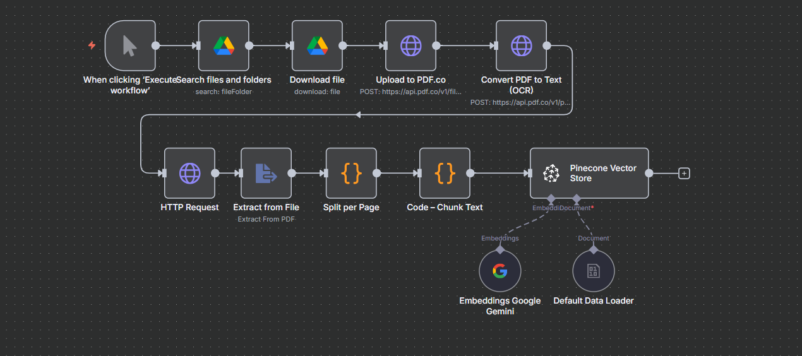
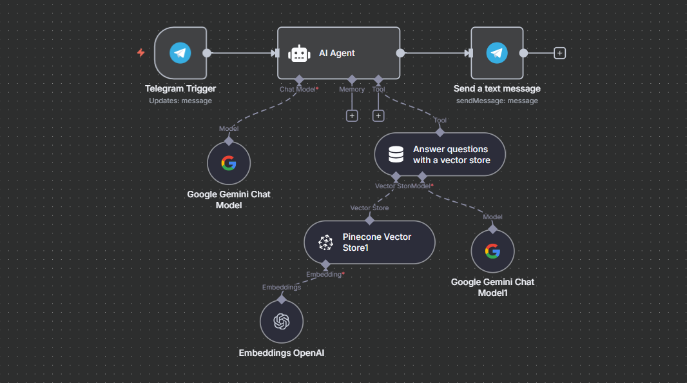

# RAG FDI Advisor - n8n Workflow

A comprehensive n8n workflow system for building a Retrieval-Augmented Generation (RAG) AI agent specialized in Foreign Direct Investment (FDI) advisory services, particularly focused on Ethiopian investment policies and opportunities.

## 📋 Overview

This project contains three interconnected n8n workflows that work together to create an intelligent FDI advisory system:

1. **Agentic RAG** - Main document ingestion and processing workflow
2. **RAG with OCR** - Enhanced document processing with OCR capabilities
3. **User Query Agent** - Interactive chat interface for querying the knowledge base

## 🏗️ Architecture

The system follows a three-tier architecture:

```
📁 Documents (Knowledge Base)
    ↓
🔄 Agentic RAG (Document Processing)
    ↓
💬 User Query Agent (Interactive Interface)
```

## 📚 Knowledge Base

The system processes the following Ethiopian investment documents:

- **Ethiopia - Investment Proclamation No1180_2020 (English).pdf** - Official investment proclamation
- **Ethiopia-Investment-Policies-and-Incentives-and-Opportunities.pdf** - Investment policies and incentives
- **Ethiopian-Investment-Guide-2023.pdf** - Comprehensive investment guide
- **wb-UNCTAD-investment-reports.pdf** - World Bank and UNCTAD investment reports

## 🔧 Workflow Components

### 1. Agentic RAG Workflow

- **Purpose**: Document ingestion and processing
- **Features**:
  - Google Drive integration for document retrieval
  - PDF processing and text extraction
  - Vector database storage for semantic search
  - Document chunking and embedding generation

### 2. RAG with OCR Workflow

- **Purpose**: Enhanced document processing with OCR capabilities
- **Features**:
  - Optical Character Recognition for scanned documents
  - Advanced text extraction from images
  - Improved document understanding

### 3. User Query Agent Workflow

- **Purpose**: Interactive chat interface
- **Features**:
  - Chat trigger for user interactions
  - AI Agent with Google Gemini integration
  - Contextual responses based on document knowledge
  - Real-time query processing

## 🖼️ Screenshots

### Document Ingestion Workflow


_The document processing pipeline showing how documents are ingested, processed, and stored in the vector database._

### User Query Interface


_The interactive chat interface where users can ask questions about Ethiopian investment policies and get AI-powered responses._

## 🚀 Getting Started

### Prerequisites

- n8n instance (self-hosted or cloud)
- Google Drive API credentials
- Google Gemini API key
- Vector database (Pinecone, Weaviate, or similar)

### Setup Instructions

1. **Import Workflows**

   - Import all three JSON workflow files into your n8n instance
   - Configure credentials for Google Drive and Google Gemini

2. **Configure Document Storage**

   - Set up Google Drive folder with your investment documents
   - Update folder ID in the workflows

3. **Set Up Vector Database**

   - Configure your preferred vector database
   - Update connection settings in the workflows

4. **Deploy and Test**
   - Execute the Agentic RAG workflow to process documents
   - Test the User Query Agent with sample questions

## 🔑 Key Features

- **Document Processing**: Automated ingestion of PDF documents from Google Drive
- **OCR Capabilities**: Text extraction from scanned documents and images
- **Semantic Search**: Vector-based similarity search for relevant information
- **AI-Powered Responses**: Contextual answers using Google Gemini
- **Multi-Document Knowledge Base**: Comprehensive coverage of Ethiopian investment policies

## 📊 Use Cases

- **Investment Advisory**: Get specific information about Ethiopian investment policies
- **Policy Research**: Find relevant sections from investment documents
- **Compliance Checking**: Verify investment requirements and procedures
- **Educational Support**: Learn about Ethiopian investment laws and regulations

## 🛠️ Technical Stack

- **n8n**: Workflow automation platform
- **Google Drive API**: Document storage and retrieval
- **Google Gemini**: Large language model for AI responses
- **Vector Database**: Semantic search and retrieval
- **OCR Technology**: Text extraction from scanned pdfs

## 📝 Notes

- Ensure all API credentials are properly configured
- The system is optimized for Ethiopian investment documents
- Regular updates to the knowledge base are recommended
- Monitor API usage and costs for Google services
